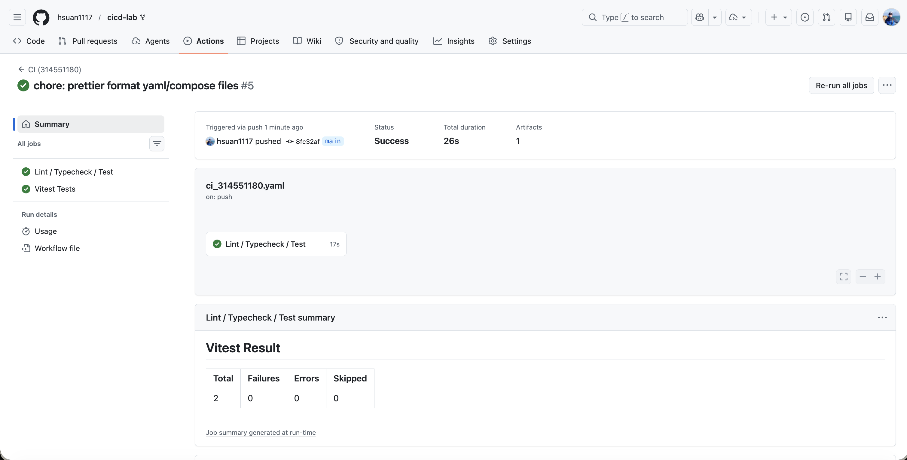
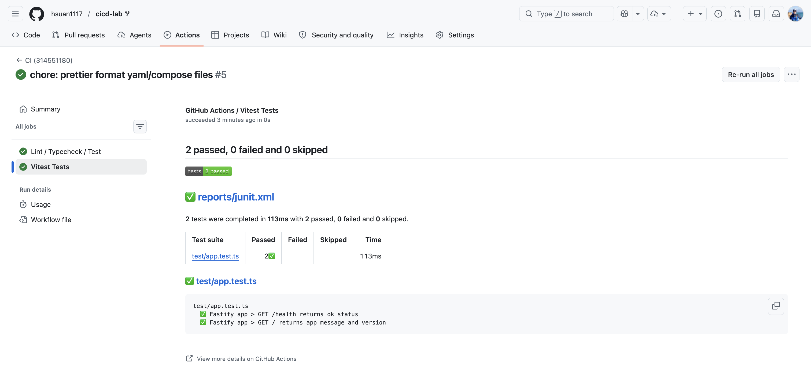
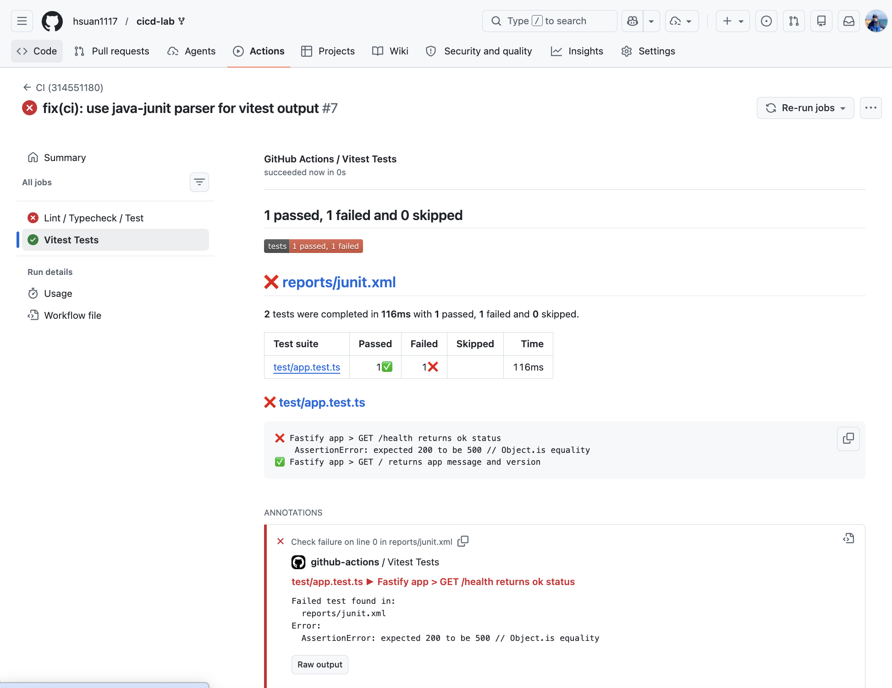
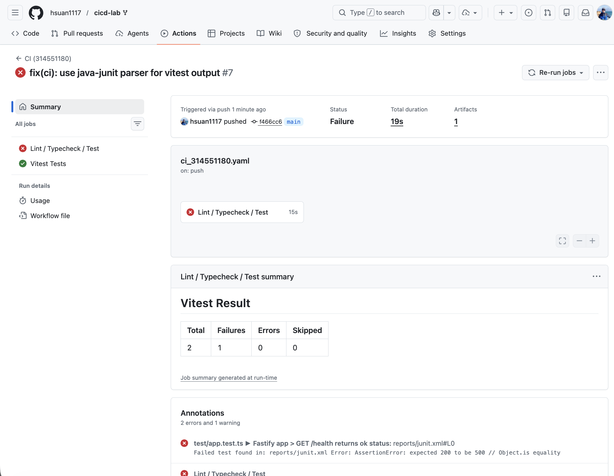

# CICD 作業報告

- **學號**：314551180
- **專案**：cicd-lab (Fastify + TypeScript + Vitest)
- **Workflow 檔案**：`.github/workflows/ci_314551180.yaml`

---

## 一、CI Pipeline 說明

### 1.1 Workflow 主要內容

```yaml
name: CI (314551180)

on: push

jobs:
  ci:
    name: Lint / Typecheck / Test
    runs-on: ubuntu-latest

    steps:
      - name: Checkout
        uses: actions/checkout@v4

      - name: Setup Node.js
        uses: actions/setup-node@v4
        with:
          node-version: '22'
          cache: 'npm'

      - name: Install dependencies
        run: npm ci

      - name: TypeScript typecheck
        run: npm run typecheck

      - name: Prettier check
        run: npm run format:check

      - name: Run tests (with JUnit report)
        run: npx vitest run --reporter=default --reporter=junit --outputFile=reports/junit.xml

      - name: Publish test report
        if: always()
        uses: dorny/test-reporter@v1
        with:
          name: Vitest Tests
          path: reports/junit.xml
          reporter: jest-junit
          fail-on-error: false

      - name: Append summary to job page
        if: always()
        shell: bash
        run: |
          {
            echo "## Vitest Result"
            if [ -f reports/junit.xml ]; then
              tests=$(grep -oE 'tests="[0-9]+"' reports/junit.xml | head -1 | grep -oE '[0-9]+')
              failures=$(grep -oE 'failures="[0-9]+"' reports/junit.xml | head -1 | grep -oE '[0-9]+')
              errors=$(grep -oE 'errors="[0-9]+"' reports/junit.xml | head -1 | grep -oE '[0-9]+')
              skipped=$(grep -oE 'skipped="[0-9]+"' reports/junit.xml | head -1 | grep -oE '[0-9]+')
              echo "| Total | Failures | Errors | Skipped |"
              echo "|-------|----------|--------|---------|"
              echo "| ${tests:-0} | ${failures:-0} | ${errors:-0} | ${skipped:-0} |"
            else
              echo "_No JUnit report produced._"
            fi
          } >> "$GITHUB_STEP_SUMMARY"

      - name: Upload JUnit report
        if: always()
        uses: actions/upload-artifact@v4
        with:
          name: junit-report
          path: reports/junit.xml
          if-no-files-found: ignore
```

### 1.2 Pipeline 設計說明

**觸發條件**：`on: push`，只要任何分支有 push 事件即自動執行，符合作業「push 時自動執行」要求。

**執行環境**：`ubuntu-latest` + Node.js 22（與 `package.json` 中 `engines.node` 範圍 `>=22 <25` 一致）。透過 `actions/setup-node@v4` 的 `cache: 'npm'` 加速重複執行的依賴安裝。

**三項必要檢查**（每個檢查獨立成 step，任一失敗 GitHub Actions 預設將整個 job 標為失敗）：

1. **TypeScript Typecheck** — `npm run typecheck`，等同 `tsc --noEmit`，純型別檢查不產生輸出檔。
2. **Prettier Check** — `npm run format:check`，使用 `prettier --check .` 驗證所有檔案的格式。
3. **Test** — `npx vitest run` 同時帶 `default`（CLI 可讀輸出）與 `junit`（機器可讀報告）兩個 reporter，把結果寫到 `reports/junit.xml`。

**測試結果展示策略**：

| 機制          | 工具                                             | 顯示位置                                                                 |
| ----------- | ---------------------------------------------- | -------------------------------------------------------------------- |
| 測試報告 Tab    | `dorny/test-reporter@v1`（GitHub Marketplace）   | Actions run 結果頁的 "Vitest Tests" 分頁，可逐筆檢視通過/失敗 case                   |
| Job Summary | 內建 `$GITHUB_STEP_SUMMARY` + shell 解析 junit.xml | Actions run 主頁直接顯示 Markdown 統計表（Total / Failures / Errors / Skipped） |
| Artifact    | `actions/upload-artifact@v4`                   | 提供 `junit-report` artifact 下載原始 XML                                  |

報告與 Summary 步驟都加上 `if: always()`，確保即便測試失敗仍會發佈報告，方便定位錯誤。

**工具與策略總結**：

- 使用專案既有的 npm scripts，避免在 workflow 重複定義指令。
- 採用 vitest 內建的 `junit` reporter（無需額外安裝套件）。
- 採用 GitHub Marketplace 上知名的 `dorny/test-reporter` 作為視覺化呈現。
- 用 `cache: 'npm'` 與 `npm ci` 確保依賴安裝可重現且快速。

---

## 二、CI 執行結果截圖

### 2.1 成功案例




---

## 三、失敗案例說明

為了驗證「任一檢查失敗時 pipeline 顯示失敗」，故意在 `test/app.test.ts` 中製造一個測試失敗：

### 3.1 錯誤製造方式（Test 失敗）

將某個測試的預期值改錯，例如：

```ts
// test/app.test.ts
it('GET /health returns ok', async () => {
  const res = await app.inject({ method: 'GET', url: '/health' });
  expect(res.statusCode).toBe(500); // 故意改錯：實際應為 200
});
```

### 3.2 Pipeline 失敗截圖




### 3.3 錯誤原因與修正方式

- **原因**：`/health` route 實作回傳 HTTP 200，但測試 expect 為 500，導致 vitest 斷言失敗，`Run tests` step exit code 非 0，GitHub Actions 將整個 job 標記為 failure。
- **修正**：把 `expect(res.statusCode).toBe(500)` 改回 `expect(res.statusCode).toBe(200)`，重新 push，pipeline 再次跑過即恢復綠燈。

> 同樣的失敗策略也適用於：
> 
> - **TypeScript 型別錯誤**：在 `src/server.ts` 加 `const x: number = 'str';`，`npm run typecheck` 會在 ts(2322) 失敗。
> - **Prettier 格式錯誤**：在任一 `.ts` 檔加多餘空白後不執行 `npm run format`，`format:check` 會列出 code style issues 並 exit 1。

---

## 四、結論

本次作業透過 GitHub Actions 建立了一條符合 push 觸發、三項自動檢查（typecheck / prettier / test）、結果可視化（dorny test-reporter + Job Summary + artifact）的 CI Pipeline。任一檢查失敗皆會即時反映在 Actions 結果頁，符合作業全部要求。
